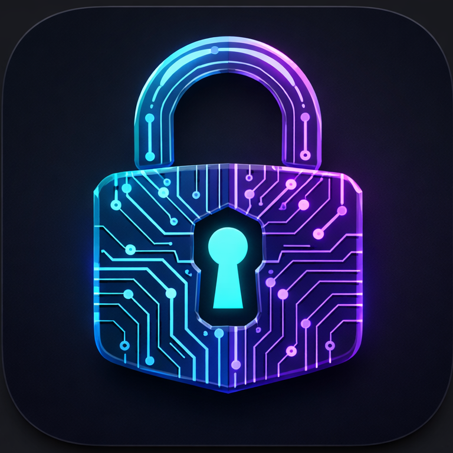

# Cipher



Cipher is a secure, cross-platform desktop application designed to encrypt and decrypt your sensitive files with ease. Built with modern web technologies, it provides a clean, transparent, and user-friendly interface to protect your data locally.

## ✨ Features

- **Secure Encryption & Decryption:** Protect your files using advanced cryptography.
- **Password Recovery System:** Set up security questions to recover access if you forget your password, powered by RSA key pairs.
- **Cross-Platform Support:** Works seamlessly on Windows, macOS, and Linux.
- **Drag & Drop Interface:** Easily encrypt or decrypt files by dropping them into the application.
- **Native OS Integration:** Open files directly with Cipher through your operating system's file explorer.
- **Beautiful UI:** A transparent, sleek, and modern drag-and-drop interface.
- **Multi-Language Support:** Available in English and Spanish.
- **Automatic Cleanup:** Securely shreds temporary files and cleans up its environment after use.

## 🛠 Technologies Used

Cipher is built utilizing an Electron-Vite stack:

- **[Electron](https://www.electronjs.org/):** Framework for building native desktop applications using web technologies.
- **[React](https://reactjs.org/):** JavaScript library for building the user interface.
- **[TypeScript](https://www.typescriptlang.org/):** Strongly typed programming language that builds on JavaScript for better developer experience and reliability.
- **[Vite](https://vitejs.dev/):** Next-generation frontend tooling for extremely fast development and building.

## 🚀 Getting Started

### Prerequisites

To build and run Cipher from source, you will need:
- [Node.js](https://nodejs.org/) (v16.x or newer recommended)
- [pnpm](https://pnpm.io/) package manager

### Installation

1. **Clone the repository:**
   ```bash
   git clone https://github.com/Rosales-Diego/Cipher.git
   cd Cipher
   ```

2. **Install dependencies:**
   ```bash
      pnpm install
   ```

### Development

To start the app in development mode with hot-reloading:

```bash
pnpm dev
```
### Building the Application

You can build the application for different operating systems using the built-in scripts. The compiled binaries will be available in the `dist` or release folder.

- **For Windows:**
  ```bash
  pnpm build:win
  ```

- **For macOS:**
  ```bash
    pnpm build:mac
  ```

- **For Linux:**
  ```bash
  pnpm build:linux
  ```

- **Universal Build (compiles TypeScript and bundles without packaging):**
  ```bash
  pnpm build
  ```

## 📖 How to Use

1. **First-Time Setup:** Upon launching Cipher for the first time, you will be prompted to set up security questions. This creates a secure RSA key pair used to help you recover your files if you lose your password.
2. **Encrypting Files:** Drag and drop files you want to secure into the Cipher window, enter a strong password, and click Encrypt. Cipher will protect your files and safely remove the original unprotected versions.
3. **Decrypting Files:** Drag a `.cipher` file into the app, enter your password, and click Decrypt. You can choose to securely extract the files temporarily, or fully restore them.
4. **Settings:** You can change your preferred language from the settings menu.

## 🛡️ Security Note

Cipher performs local encryption. While it employs strong security rules and cleans up temporary files (including securely shredding them from the cache), the overall security of your data still depends on choosing a strong, memorable password and keeping your operating system secure.

## 🚫 Unsupported Files and Paths for Encryption

To protect your system's integrity and prevent unintended behavior, Cipher specifically blocks certain files, extensions, and paths from being encrypted. If you attempt to process these, the application will reject them.

### What is blocked and why?

**1. Critical Operating System Paths:**
Encrypting system folders could permanently break your operating system or installed applications.
- **Windows:** `C:\Windows`
- **macOS:** `/System`, `/usr`
- **Linux:** `/bin`, `/usr`, `/etc`, `/var`, `/proc`, `/sys`, `/dev`

**2. Executables & System Extensions:**
Encrypting binary files and core dependencies often results in application corruption and makes the system unstable.
- **Windows:** `.exe`, `.dll`, `.sys`
- **macOS:** `.app`, `.pkg`
- **Linux:** `.bin`, `.sh`

**3. Special System Files:**
- **Symbolic Links (Shortcuts):** Blocked to prevent infinite loops or accidentally encrypting files located elsewhere on your drive.
- **FIFOs and Sockets:** These are live system data streams, not standard data files, and cannot be encrypted.

**4. Reserved Paths:**
- The root working directory (`.`), parent directories (`..`), or any path that leads to the application's own root environment. This prevents Cipher from accidentally breaking itself or the folder it runs in.

**5. Inaccessible Files:**
- Any file that your user account does not have read/write access to (due to OS permission restrictions).

